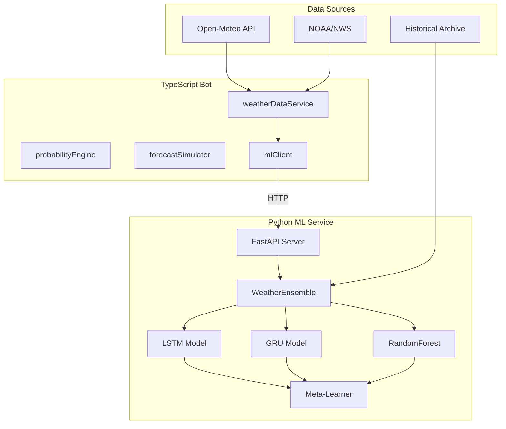

# Implementation Plan: Hybrid ML Weather Prediction Model

## Background

The current weather bot uses a simple Gaussian probability model with configurable sigma based on lead time. While functional, this approach doesn't learn from historical patterns, seasonal trends, or the actual performance of weather forecasts.

## Goal

Implement a hybrid Python machine learning ensemble model that:
1. Uses LSTM, GRU, and Random Forest models in an ensemble
2. Learns from historical weather data and forecast performance
3. Achieves measurably better prediction accuracy than the baseline
4. Results in **positive PNL** across multiple random seeds

---

## Proposed Changes

### ML Module (`src/ml/`)

#### [NEW] [models/](file:///Users/kcao/Documents/polymarket-weather-bot/src/ml/models/)
Python ML model implementations.

#### [NEW] [weather_ensemble.py](file:///Users/kcao/Documents/polymarket-weather-bot/src/ml/models/weather_ensemble.py)
Hybrid ensemble model with:
- **LSTM** (Long Short-Term Memory): Captures long-term temperature patterns and seasonal trends
- **GRU** (Gated Recurrent Unit): Fast, efficient for short-term dependencies
- **RandomForest Regressor**: Non-neural baseline capturing feature-based patterns
- **Meta-learner (Ridge Regression)**: Combines model predictions optimally

```python
class WeatherEnsemble:
    def __init__(self, lookback_days=14, horizon_days=7):
        self.lstm_model = None
        self.gru_model = None
        self.rf_model = None
        self.meta_learner = None

    def train(self, X, y_high, y_low):
        # Train individual models
        # Train meta-learner on OOF predictions

    def predict(self, X) -> dict:
        # Returns: {
        #   'high_mean': float,
        #   'high_std': float,
        #   'low_mean': float,
        #   'low_std': float,
        #   'model_weights': dict
        # }
```

---

#### [NEW] [data_pipeline.py](file:///Users/kcao/Documents/polymarket-weather-bot/src/ml/data_pipeline.py)
Historical data collection and feature engineering.

**Data Sources:**
- Open-Meteo Archive API (2022-present)
- NOAA historical data (backup)

**Features:**
- Temperature sequences (past N days high/low)
- Seasonality (sin/cos day-of-year encoding)
- Day of week encoding
- Rolling statistics (7-day, 14-day, 30-day)
- Trend indicators (derivative of rolling mean)
- Forecast error history (if available)

```python
def fetch_historical_data(station_id: str, start_date: str, end_date: str) -> pd.DataFrame:
    """Fetch historical weather data from Open-Meteo Archive"""

def engineer_features(df: pd.DataFrame, lookback: int = 14) -> np.ndarray:
    """Create ML features from raw weather data"""
```

---

#### [NEW] [api_server.py](file:///Users/kcao/Documents/polymarket-weather-bot/src/ml/api_server.py)
FastAPI server for TypeScript integration.

```python
from fastapi import FastAPI

app = FastAPI()

@app.post("/predict")
async def predict(request: PredictRequest) -> PredictResponse:
    """
    Input: station_id, target_date, current forecast values
    Output: ML-enhanced prediction with uncertainty
    """

@app.get("/health")
async def health():
    return {"status": "ok", "model_loaded": True}
```

---

#### [NEW] [train.py](file:///Users/kcao/Documents/polymarket-weather-bot/src/ml/train.py)
Training script with cross-validation.

```python
def train_model(
    cities: List[str],
    start_date: str,
    end_date: str,
    output_path: str
):
    """
    1. Fetch historical data for all cities
    2. Engineer features
    3. Time-series cross-validation (avoid leakage)
    4. Train ensemble
    5. Save model artifacts
    """
```

---

### TypeScript Integration

#### [MODIFY] [weatherDataService.ts](file:///Users/kcao/Documents/polymarket-weather-bot/src/services/weatherDataService.ts)
Add ML prediction fallback/enhancement.

```typescript
// Add new function
export async function getMLEnhancedForecast(
    stationId: string,
    targetDate: string,
    baseForecast: WeatherForecast
): Promise<MLEnhancedForecast> {
    // Call Python ML API
    // Combine with base forecast
    // Return enhanced prediction with uncertainty
}
```

---

#### [MODIFY] [probabilityEngine.ts](file:///Users/kcao/Documents/polymarket-weather-bot/src/services/probabilityEngine.ts)
Use ML-derived sigma instead of static lookup.

**Key Changes:**
- Add `MLEnhancedConfig` interface
- Modify `computeBinProbabilities` to accept ML sigma
- Add `getMLProbabilities` function for full ML mode

---

#### [MODIFY] [forecastSimulator.ts](file:///Users/kcao/Documents/polymarket-weather-bot/src/simulation/forecastSimulator.ts)
Add ML mode to simulation.

```typescript
export interface ForecastConfig {
    mode: 'REAL' | 'SYNTHETIC' | 'ML_ENHANCED';
    mlConfig?: {
        apiUrl: string;
        fallbackToSynthetic: boolean;
    };
    // ... existing fields
}
```

---

#### [NEW] [mlClient.ts](file:///Users/kcao/Documents/polymarket-weather-bot/src/services/mlClient.ts)
TypeScript client for Python ML API.

```typescript
interface MLPrediction {
    highMean: number;
    highStd: number;
    lowMean: number;
    lowStd: number;
    modelWeights: Record<string, number>;
    confidence: number;
}

export async function getMLPrediction(
    stationId: string,
    targetDate: string,
    leadDays: number
): Promise<MLPrediction | null>
```

---

### Python Dependencies

#### [NEW] [requirements.txt](file:///Users/kcao/Documents/polymarket-weather-bot/src/ml/requirements.txt)
```
numpy>=1.24.0
pandas>=2.0.0
scikit-learn>=1.3.0
tensorflow>=2.14.0
keras>=3.0.0
fastapi>=0.109.0
uvicorn>=0.27.0
requests>=2.31.0
python-dotenv>=1.0.0
joblib>=1.3.0
```

---

### Scripts

#### [NEW] [collectTrainingData.ts](file:///Users/kcao/Documents/polymarket-weather-bot/src/scripts/collectTrainingData.ts)
Fetch and save historical weather data for ML training.

#### [MODIFY] [optimizeStrategy.ts](file:///Users/kcao/Documents/polymarket-weather-bot/src/scripts/optimizeStrategy.ts)
Add ML model mode to optimization grid.

---

## Architecture Diagram



---

## Verification Plan

### Automated Tests

1. **Unit Tests for ML Model**
   ```bash
   cd src/ml && python -m pytest tests/
   ```

2. **Integration Test**
   ```bash
   # Start ML server
   python src/ml/api_server.py &

   # Run TypeScript tests
   npm run test-ml-integration
   ```

3. **Multi-Seed Backtest (Critical)**
   ```bash
   # Run optimization with 10+ seeds
   npm run optimize -- --mode=ML --seeds=20
   ```

### Success Criteria

1. **Brier Score Improvement**: ML model Brier score < baseline by at least 5%
2. **Positive Median PNL**: Across 20 random seeds, median PNL > $0
3. **Robust Calmar Ratio**: Median Calmar > 0.5
4. **Worst-Case Drawdown**: < 30% across all seeds

---

## Implementation Order

1. **Phase 1: Python ML Core** (Day 1)
   - Create `src/ml/` directory structure
   - Implement data pipeline
   - Implement ensemble model
   - Basic training script

2. **Phase 2: Training & Validation** (Day 1-2)
   - Collect historical data
   - Train model on NYC data
   - Validate on held-out data
   - Tune hyperparameters

3. **Phase 3: TypeScript Integration** (Day 2)
   - Implement FastAPI server
   - Create mlClient.ts
   - Modify probabilityEngine
   - Update forecastSimulator

4. **Phase 4: Backtesting** (Day 2-3)
   - Run multi-seed backtests
   - Compare ML vs baseline
   - Iterate on model if needed

5. **Phase 5: Production Config** (Day 3)
   - Finalize configuration
   - Generate .env with optimal params
   - Documentation update

---

## Risks & Mitigations

| Risk | Mitigation |
|------|------------|
| Model overfits to training data | Time-series CV, multi-seed validation |
| Python-TypeScript latency | Local API server, caching |
| API rate limits (Open-Meteo) | Batch requests, local caching |
| Model too complex for edge | Use lightweight models, quantization |
| Insufficient training data | Use multiple cities, data augmentation |
